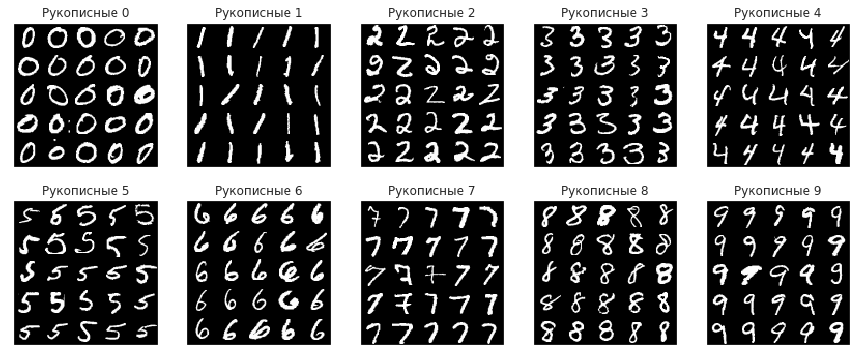
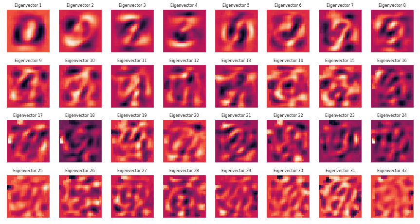

[](https://colab.research.google.com/drive/1FI2d2_WbCRL9dz03HTkJ85LVvgEmGNL3)
[](#)

Данный материал является дополнением к [лекциям проф. Клюшин Д. А.][klyushin] по распознаванию образов, а именно &mdash; к лекции о [линейном дискриминаторе Фишера][klyushin-lda]. В данном разделе, мы глубже рассмотрим данный алгоритм на примере проблемы снижения размерности данных базы [MNIST][mnist] вручную написанных цифр, а так же другие методы, а именно:

- Метод главных компонент (PCA) вместе с методом $$k$$-средних
- Линейный дискриминатор Фишера (LDA)
- Стохастическое вложение соседей с $$t$$-распределением (T-SNE)


## База рукописных цифр MNIST

[MNIST][mnist] (**M**odified **N**ational **I**nstitute of **S**tandards and **T**echnology) &mdash; объёмная база данных образцов рукописного написания цифр (изображения размером `(28, 28)`. Является одним из стандатрных датасетов как для тестирования новых алгоритмов, так и для демонстрации методов компьютерного зрения.

### Загрузка

Из-за своей популярности, почти все современные библиотеки для машинного обучения позволяют автоматически загрузить эту базу. Сделаем это с помощью `sklearn.datasets`, после чего сделаем нормализацию данных:

```python
from sklearn.datasets import fetch_openml
images, labels = fetch_openml('mnist_784', version=1, return_X_y=True)
```

Перед тем как приступить работу с данными, всегда полезно глянуть глазами как оно вообще выглядит. 


```python
import matplotlib.pyplot as plt
import numpy as np

plt.figure(figsize=(15,6))
for digit in range(10):
    cols = []
    for col in range(5):
        digit_indices = label_indices[digit][col*5:(col+1)*5]
        cols.append(np.concatenate(images[digit_indices].reshape(5, 28, 28)))
        vis = np.concatenate(cols, axis=1)
    plt.subplot(2, 5, digit + 1), plt.title('Рукописные '+str(digit))
    plt.xticks([]), plt.yticks([])
    plt.imshow(vis, 'gray')
```







### Собственные значения и вектора

Перед тем как приступать с следующим действиям, неплохо было бы нормализировать наши данные. Ведь они пока лежат в диапазоне `0 .. 255` &mdash; неочень удобный диапазон. Так же, поскольку у нас ограниченное количество вычислительной мощности, будем ограничиваться лишь `6000` семплами датасета.

```python
from sklearn.preprocessing import StandardScaler
X_std = StandardScaler().fit_transform(X)
X, Y = images[:6000], Y = labels[:6000]
```


```python
# Calculating Eigenvectors and eigenvalues of Cov matirx
cov_mat = np.cov(X_std.T)
eig_vals, eig_vecs = np.linalg.eigh(cov_mat)

# Sort indices by the descendance of eigenvalues
idx = np.flip(np.argsort(eig_vals))

# Calculation of Explained Variance from the eigenvalues
var_exp = 100 * eig_vals[idx[:100]] / eig_vals.sum() # Individual explained variance
cum_var_exp = np.cumsum(var_exp) # Cumulative explained variance
```







```python
n_row, n_col = 4, 8
plt.figure(figsize=(15,8))
for i in range(n_row * n_col):
    plt.subplot(n_row, n_col, i+1)
    plt.imshow(eig_vecs.T[idx][i].reshape(28, 28))
    plt.title('Eigenvector {}'.format(i+1), size=8)
    plt.xticks(()), plt.yticks(())
```







## Метод главных компонент (PCA)


### Визуализация


```python
from sklearn.decomposition import PCA
pca = PCA(n_components=2)
pca.fit(X_std)
X_nd = pca.transform(X_std)
```







### Кластеризация методом k-средних


```python
from sklearn.cluster import KMeans
kmeans = KMeans(n_clusters=10)
X_clustered = kmeans.fit_predict(X_std)
```







## Линейный дискриминатор Фишера (LDA)

### Визуализация


```python
from sklearn.discriminant_analysis import LinearDiscriminantAnalysis as LDA
lda = LDA(n_components=2)
X_LDA_2D = lda.fit_transform(X_std, Y)
```






## Стохастическое вложение соседей (T-SNE)

### Визуализация


```python
from sklearn.manifold import TSNE
tsne = TSNE(n_components=2)
tsne_results = tsne.fit_transform(X_std)
```






[klyushin]: http://om.univ.kiev.ua/ua/user-15/Pattern
[klyushin-lda]: http://om.univ.kiev.ua/users_upload/15/upload/file/pr_lecture_09.pdf
[mnist]: http://yann.lecun.com/exdb/mnist/index.html
