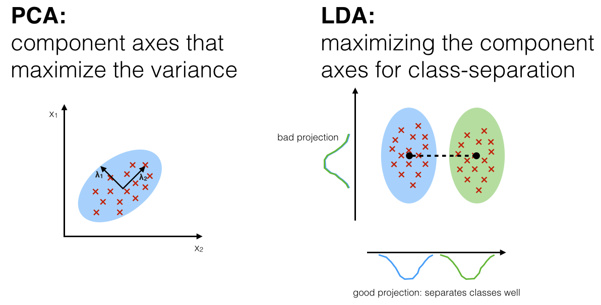

[](https://colab.research.google.com/drive/1FI2d2_WbCRL9dz03HTkJ85LVvgEmGNL3)
[](#)

> Данный материал является дополнением к [лекциям проф. Клюшин Д. А.][klyushin] по распознаванию образов, а именно &mdash; к лекции о [линейном дискриминаторе Фишера][klyushin-lda].

В данном разделе, мы глубже рассмотрим данный алгоритм на примере проблемы снижения размерности данных [MNIST][mnist], и так же другие методы:

- [Метод главных компонент (PCA) вместе с методом $$k$$-средних](#13-метод-главных-компонент-pca)
- [Линейный дискриминатор Фишера (LDA)](#14-линейный-дискриминатор-фишера-lda)
- [Стохастическое вложение соседей с $$t$$-распределением (t-SNE)](#15-стохастическое-вложение-соседей-t-sne)

Первые два метода являются классическими, в то время как последнее является одним из самых популярных методов для снижения размерности.

<a name="#section1">
## 1.1. Зачем?

На практике, зачастую приходится работать с данными очень больших размерностей. Так. например, изображения размером `224x224` пикселей &mdash; по сути вектора в $$\mathbb{R}^{50176}$$; данные финансовых изменений по времени &mdash; тоже вектора огромных размерностей.

> **Вопрос.** Можно ли преобразовать/спроецировать наши данные на пространство меньшей размерности, чтоб лучше понять: отделимы ли наши данные? Если да, то как?

На практике, классы методов снижения размерности используются для таких целей:

- Выявление дефектов в данных, которые потом будут вскармливать для тренировки огромных нейронных сетей.
- Когда данных мало, легче их удобным образом спроецировать на пространство меньшей размерности, а потом уже применять SVM, NB, и т.д.
- Визуально посмотреть на данные и посмотреть, какие параметры больше влияют на результат, какие кластеры легко отделимы, и т.д. 


<a name="#section2">
## 1.2. База рукописных цифр MNIST

[MNIST][mnist] (**M**odified **N**ational **I**nstitute of **S**tandards and **T**echnology) &mdash; объёмная база данных образцов рукописного написания цифр (изображения размером `(28, 28)`. Является одним из стандатрных датасетов как для тестирования новых алгоритмов, так и для демонстрации методов компьютерного зрения.

### Загрузка и обработка

Из-за своей популярности, почти все современные библиотеки для машинного обучения позволяют автоматически загрузить эту базу. Сделаем это с помощью `sklearn.datasets`, после чего сделаем нормализацию данных:

```python
from sklearn.datasets import fetch_openml
images, labels = fetch_openml('mnist_784', version=1, return_X_y=True)
```

Перед тем как приступить работу с данными, всегда полезно глянуть глазами как оно вообще выглядит. 


```python
import matplotlib.pyplot as plt
import numpy as np

plt.figure(figsize=(15,6))
for digit in range(10):
    cols = []
    for col in range(5):
        digit_indices = label_indices[digit][col*5:(col+1)*5]
        cols.append(np.concatenate(images[digit_indices].reshape(5, 28, 28)))
        vis = np.concatenate(cols, axis=1)
    plt.subplot(2, 5, digit + 1), plt.title('Рукописные '+str(digit))
    plt.xticks([]), plt.yticks([])
    plt.imshow(vis, 'gray')
```






Перед тем как приступать с следующим действиям, неплохо было бы нормализировать наши данные. Ведь они пока лежат в диапазоне `0 .. 255` &mdash; неочень удобный диапазон. Так же, поскольку у нас ограниченное количество вычислительной мощности, будем ограничиваться лишь `6000` семплами датасета.

```python
from sklearn.preprocessing import StandardScaler
X_std = StandardScaler().fit_transform(X)
X, Y = images[:6000], Y = labels[:6000]
```

<a name="#section3">
## 1.3. Метод главных компонент (PCA)

[**PCA**][pca] (**P**rincipal **C**omponent **A**nalysis) &mdash; один из простейших, но самых распостранённых линейных методов уменьшить [размерности][dimensionality] данных, потеряв при этом наименьшее количество информации.

Пусть $$\boldsymbol{X} = (\boldsymbol{X}_1, \boldsymbol{X}_2, \ldots, \boldsymbol{X}_n)^\intercal$$ &mdash; матрица размером $$n \times d$$ наших изображений, выравненные в вектора.
Посчитаем собственные вектора емпирической матрицы ковариации

$$
\begin{equation} \label{empirical-cov} \tag{1.1}
\mathrm{Cov}[\boldsymbol{X}, \boldsymbol{X}] \approx \frac{1}{n-1} \sum_{i=1}^n {\left(\boldsymbol{x}_i - \bar{\boldsymbol{x}}\right) \left(\boldsymbol{x}_i - \bar{\boldsymbol{x}}\right)^\intercal}
\end{equation}
$$

 и посмотрим на отсортированные собственные значения $$\lambda_i$$:


```python
# Calculating Eigenvectors and eigenvalues of Cov matirx
cov_mat = np.cov(X_std.T)
eig_vals, eig_vecs = np.linalg.eigh(cov_mat)

# Sort indices by the descendance of eigenvalues
idx = np.flip(np.argsort(eig_vals))

# Calculation of Explained Variance from the eigenvalues
var_exp = 100 * eig_vals[idx[:100]] / eig_vals.sum() # Individual explained variance
cum_var_exp = np.cumsum(var_exp) # Cumulative explained variance
```






Можем заметить следующее: собственные значения (чёрные точки) уменьшаются експоненциально. Это означает, что некоторые направления намного "важнее" других &mdash; если представить множество наших точек (изображений), то такое множество наиболее "растянуто" по этим направлениям.

Давайте посмотрим, как же выглядит собственные вектора $$\boldsymbol{v}_i$$ в порядке уменьшения их собственных значений:


```python
n_row, n_col = 4, 8
plt.figure(figsize=(15,8))
for i in range(n_row * n_col):
    plt.subplot(n_row, n_col, i+1)
    plt.imshow(eig_vecs.T[idx][i].reshape(28, 28))
    plt.title('Eigenvector {}'.format(i+1), size=8)
    plt.xticks(()), plt.yticks(())
```






Визуально можно увидеть, что вектора с наибольшим собственным значением выглядит как "шаблон" для некоторых цифр, в то время как последние вектора с меньшими собственными значениями визуально не несут никакого семантического значения.

Идея метода главных компонент (PCA) заключается в том, что, посчитав собственные вектора матрицы $$\ref{empirical-cov}$$, спроецировать наши точки $$\boldsymbol{X}$$ на подпространство, порождаемое первыми $$k$$ собственными векторами с наибольшим собственным значением:

$$
\begin{equation}\label{projection} \tag{1.2}
\boldsymbol{Y} = \boldsymbol{X} \times \boldsymbol{W}\,,
\end{equation}
$$

где $$\boldsymbol{W} = (\boldsymbol{v}_{s(1)}, \boldsymbol{v}_{s(2)}, \ldots, \boldsymbol{v}_{s(k)})$$ &mdash; матрица $$k \times d$$ векторов с наибольшими собственными значениями ($$s(i)$$ &mdash; сортировка индексов).

### Визуализация


```python
from sklearn.decomposition import PCA
pca = PCA(n_components=2)
pca.fit(X_std)
X_nd = pca.transform(X_std)
```






По визуализации сверху видим, что PCA неплохо справляется с задачей поиска наиболее выразительной проекции &mdash; можем чётко видеть отдельные кластеры цифр.


### Кластеризация методом k-средних

Метод [$$k$$-средних][kmeans] &mdash; один из наиболее популярных методов клаастеризации, зачастую используют вместе с методом главных компонент для выявления возможных кластеров. Данный метод разделяет наше множество точек на $$k$$ *кластеров*, таким образом, чтоб минимизировать дисперцию внутри этих кластеров:

$$
\begin{equation} \label{kmeans-var} \tag{1.3}
\underset{\boldsymbol{S}}{\mathrm{arg\,min}}
\sum_{i=1}^k {
	\sum_{\boldsymbol{x} \in S_i} {| S_i | \mathrm{Var} S_i}}\,,
\end{equation}
$$

где $$S_i$$ &mdash; полученные кластеры, $$i = 1, 2, \ldots, k\,$$. Это эквивалентно минимизации суммарного квадратичного отклонения точек кластеров от центров этих кластеров: 

$$
\begin{equation} \label{kmeans-rms} \tag{1.4}
\underset{\boldsymbol{S}}{\mathrm{arg\,min}}
\sum_{i=1}^k {
	\sum_{\boldsymbol{x} \in S_i} \left\| \boldsymbol{x} - \boldsymbol{\mu}_i \right\|^2
}
\end{equation}
$$

где $$\boldsymbol{\mu}_i$$ обозначает центры масс всех векторов $$\boldsymbol{x}$$ из кластера $$S_i\,$$. Разбиение после применения PCA к нашему набору изображений рукописных символов выглядит следующим образом:


```python
from sklearn.cluster import KMeans
kmeans = KMeans(n_clusters=10)
X_clustered = kmeans.fit_predict(X_std)
```






Следует заметить, что связку PCA + KMeans используют тогда, когда мы примерно знаем количество классов, но не имеем никакой информации о наших данных. К тому же, KMeans работает плохо для тесно расположенных кластеров, как показано сверху.

<a name="#section4">
## 1.4. Линейный дискриминатор Фишера (LDA)

[**LDA**][lda] (**L**inear **D**discriminant **A**nalysis) &mdash; один из простейших методов уменьшения размерности данных с учитыванием разметки класса.

Несмотря на то что данный метод изначально был создан для классификации [Рональдом Фишером][fischer] в 1936м году, ныне его наиболее часто используют для уменьшения размерности данных. Обобщённый алгоритм метода LDA для нескольких классов, предложенный [Rao C. R. (1948)][rao1948], выглядит следующим образом:

**1. Посчёт суммы $$\Sigma_W$$ матриц рассеивания внутри классов.** Пусть у нас есть классы $$D_i = (\boldsymbol{x}_1^i, \boldsymbol{x}_2^i, \ldots, \boldsymbol{x}_{k(i)}^i)$$ &mdash; множества векторов (изображений) в каждом классе. Посчитаем такую матрицу:

$$
\begin{equation} \label{scatter-sum} \tag{1.5}
\Sigma_W = \sum_{i=1}^c {\Sigma_i}
\end{equation}
$$

где $$\Sigma_i$$ &mdash; матрица рассеивания для класса $$i$$, который определяется следующим образом:

$$
\begin{equation} \label{scatter-mat} \tag{1.6}
\Sigma_i = \sum_{\boldsymbol{x} \in D_i} {
    \left( \boldsymbol{x} - \boldsymbol{m}_i \right)
    \left( \boldsymbol{x} - \boldsymbol{m}_i \right)^\intercal
}
\end{equation}
$$

где $$\boldsymbol{m}_i$$ &mdash; среднее значение векторов в $$D_i$$. По сути матрица рассевания это просто матрица ковариации, умноженное на количество векторов. Таким образом, в нашем случаи, классы с большим количеством представителей (изображений, векторов) будут больше влиять на конечную проекцию.

**2. Подсчёт матрицы $$\Sigma_B$$ рассеивания между классами.** Считается таким образом:

$$
\begin{equation} \label{scatter-betw} \tag{1.7}
\Sigma_B = \sum_{i=1}^c {N_i
	\left( \boldsymbol{m_i} - \boldsymbol{m} \right)
    \left( \boldsymbol{m_i} - \boldsymbol{m} \right)^\intercal
}\,,
\end{equation}
$$

где $$\boldsymbol{m}$$ &mdash; среднее по всем векторам, а $$\boldsymbol{m_i}$$ и $$N_i$$ &mdash; среднее по классу и количество элементов в классе $$D_i$$.

**3. Подсчёт и выбор направлении наибольшей сепарации.** [Фишер][fischer] определял значение сепарации между классами по направлению $$\vec{\boldsymbol{w}}$$ как соотношение дисперции между классами и суммарно внутри классов по этому направлению:

$$
\begin{equation} \label{separation} \tag{1.8}
S = \frac{\sigma^2_B}{\sigma^2_W} = 
\frac{
	\vec{\boldsymbol{w}}^\intercal \Sigma_B \vec{\boldsymbol{w}}
} {
	\vec{\boldsymbol{w}}^\intercal \Sigma_W \vec{\boldsymbol{w}}
}\,.
\end{equation}
$$

Это означает, что когда $$\vec{\boldsymbol{w}}$$ &mdash; собственный вектор, то его собственное значение будет равна значению сепарации по его направлению. Наша задача поиска "хорошей" проекции сводится к поиску направлений наибольшей сепарации, что эквивалентно поиску собственных значений:

$$
\begin{equation} \label{lda} \tag{1.9}
\vec{\boldsymbol{w}}, \lambda \colon
\quad \Sigma_W^{-1} \Sigma_B \vec{\boldsymbol{w}} = \lambda \vec{\boldsymbol{w}}\,,
\end{equation}
$$

после чего отсортируем вектора по возрастанию собственных значений. Пользуясь формулой $$\ref{projection}$$, спроецируем наше множество векторов (изображений) на первые $$k$$ собственных значений из $$\ref{lda}$$.

### Визуализация


```python
from sklearn.discriminant_analysis import LinearDiscriminantAnalysis as LDA
lda = LDA(n_components=2)
X_LDA_2D = lda.fit_transform(X_std, Y)
```






Можно увидеть на этом графике, что кластеры более чётко отделены и сгруппированы по сравнению с PCA. Это ожидаемо &mdash; ведь PCA не требует информации о классах, и свои плюсы проявляет как раз там, где неизвестны разметки данных. Выбираем нужный инструмент в зависимости от задачи.

### Наглядное сравнение методов PCA и LDA

Короче говоря &mdash; PCA проецирует на собственные компоненты, которые максимизируют ковариацию, в то время как LDA максимизирует показатель сепарации между классами.




<a name="#section5">
## 1.5. Стохастическое вложение соседей (t-SNE)

**t-SNE** ($$t$$-distributed **S**tochastic **N**eighbor **E**mbedding) &mdash; один из наиболее популярных нелинейных методов для снижение размерности и визуализации данных. Данный метод был [опубликован в 2008 году][tsne-paper], исследовательской группой [Джеффи Хинтона][hinton] &mdash; лауреата [Премии Тюринга 2018][touring-award], один из основателей современной теории [глубинных нейронных сетей][deep-nn] и [свёрточных сетей][cnn].

### Основная идея метода

Пусть у нас есть точки $$\boldsymbol{x}_1, \boldsymbol{x}_2, \ldots, \boldsymbol{x}_1 \in \mathbb{R}^d$$. Наша цель &mdash; найти такую биекцию, чтоб образы $$\boldsymbol{y}_1, \boldsymbol{y}_2, \ldots, \boldsymbol{y}_1 \in \mathbb{R}^2$$ в некотором смысле сохраняли такую же структуру как и свои прообразы. А именно &mdash; если две точки были близкими, то и их образы должны быть тоже близкими. Рассмотрим следующую условную меру близости между двумя точками $$\boldsymbol{x}_i$$ и $$\boldsymbol{x}_j\,$$:

$$
\begin{equation} \label{cond-similarity} \tag{1.10}
p_{i | j} = \frac{
	\exp\left(-\|\boldsymbol{x}_i - \boldsymbol{x}_j\|^2 \middle/ 2 \sigma_i^2\right)
} {
	\sum_{k \ne i}{\exp \left( -\|\boldsymbol{x}_i - \boldsymbol{x}_k\|^2 \middle/ 2 \sigma_i^2 \right)}
}\,
\end{equation}
$$

где $$\| \cdot \|$$ &mdash; евклидова норма. Условная дисперсия $$\sigma^2_i$$ индивидуальна для каждой точки $$\boldsymbol{x}_i$$ и задаётся таким образом, чтоб точкам в плотных областей соответствовало меньшее значение. Более подробное описание метода задания $$\sigma^2_i$$ можно найти в [оригинальной статье][tsne-paper].
Следует заметить, что $$p_{i|j}$$ пропорционально плотности [**гауссиана**][gaussian] с центром в точке $$ \boldsymbol{x}_i\,$$.

Теперь, мы можем задать симметричную условную меру близости между точками $$\boldsymbol{x}_i$$ и $$\boldsymbol{x}_j\,$$:

$$
\begin{equation} \label{cond-similarity-sym} \tag{1.11}
p_{ij} = \frac{p_{i|j} + p_{j|i}}{2N}\,,
\end{equation}
$$

где $$N$$ &mdash; количество точек $$\boldsymbol{x}$$ в нашем датасете (базе данных). Теперь, зададим условную меру близости между образами $$\boldsymbol{y}_i\,$$:

$$
\begin{equation} \label{cond-sim-emb} \tag{1.12}
q_{ij} = \frac{
	\left( 1 + \| \boldsymbol{y}_i - \boldsymbol{y}_j\|^2\right)^{-1}
} {
	\sum_{k \ne i}{\left( 1 + \| \boldsymbol{y}_i - \boldsymbol{y}_k \|^2 \right)^{-1}}
}\,.
\end{equation}
$$

В отличие от $$p_{ij}$$, мера близости между образами имеет [**распределение Стьюдента с 1 степенем свободы**][student]. Данный выбор вида меры близости был сделан для балансировки **проблемы сгущения** &mdash; в $$\mathbb{R}^d$$ объём шара радиусом $$r$$ растёт как $$r^d$$, а значит, при больших $$d$$ случайно выбранная точка скорее всего будет ближе к поверхности сферы. Это и было проблемой метода SNE ([Hinton, 2002][sne]). У распределения Стьюдента более тяжелые "хвосты" (т.е. оно не "кучкуется" вокруг центра как гауссиан), что позволяет компенсировать изначальную несбалансированность.

Алгоритм метода **t-SNE** идейно проста &mdash; выбираем образы $$\{ \boldsymbol{y}_i \}_{i=1}^N$$ таким образом, чтоб минимизировать [дивергенцию Кульбака &ndash; Лейбнера][dkl] между $$P = (p_{ij})$$ и $$Q = (q_{ij})\,$$:

$$
\begin{equation} \label{kldiv} \tag{1.13}
D_{KL} (P \| Q) = \sum_{i,j} {p_{ij} \log{\frac{p_{ij}}{q_{ij}}}}
\rightarrow \min
\quad
\text{w.r.t.} \enspace
\{ \boldsymbol{y}_i \}_{i=1}^N
\end{equation}
$$

градиент данной дивергенции можно найти аналитически, что позволяет нам использовать градиентные методы:

$$
\begin{equation} \label{tsne-grad} \tag{1.14}
\frac{\delta D_{KL} (P \| Q)}{\delta \boldsymbol{y}_i} =
4 \sum_j { \left(p_{ij} - q_{ij}\right) } \frac{
	\boldsymbol{y}_i - \boldsymbol{y}_j
} {
	1 + \| \boldsymbol{y}_i - \boldsymbol{y}_j \|^2
}
\end{equation}
$$

Следует заметить, что \ref{tsne-grad} является задачей **невыпуклой оптимизации** и не гарантирует нахождения оптимального решения. Более того, градиентный спуск в чистом виде для данной конкретной задачи зачастую застревает в локальном минимуме, в связи с чем в [статье 2008 года][tsne-paper] было предложено несколько эвристических трюков, которые помогают с этим эффективно бороться. Детали об этих трюках выходит за рамки данного обзора, и любопытному читателю предлагается самостоятельно прочитать [статью][tsne-paper].

### Визуализация


```python
from sklearn.manifold import TSNE
tsne = TSNE(n_components=2)
tsne_results = tsne.fit_transform(X_std)
```






Несмотря на то что **t-SNE** относится к классу алгоритмов без учителя, данный метод успешно выделило основные кластеры изображения рукописных цифр. Следует заметить, что он, как и **PCA**, ничего не знает о настоящей разметке данных.


## 1.6. Выводы

Методы снижения размерности является важным классом методов в **распознавании образов**. В данном обзоре, мы перечислили типичные сценарии использования этих методов на практике в разделе <a href="#11-зачем">1.1</a>. Потом, мы ознакомились с классическими и современными методами &mdash; **PCA** (<a href="#13-метод-главных-компонент-pca">1.3</a>), **LDA** (<a href="#14-линейный-дискриминатор-фишера-lda">1.4</a>), и **t-SNE** (<a href="#15-стохастическое-вложение-соседей-t-sne">1.5</a>). Мы так же рассмотрили минусы и плюсы этих методов, и обсудили в каких случаях лучше какой использовать.

## 1.7. Полезные ссылки

- [Статья на distill.pub про t-SNE][distill-tsne]: описывают подводные камни и тонкости использования t-SNE. Качественная статья с интерактивной визуализацией.


[klyushin]: http://om.univ.kiev.ua/ua/user-15/Pattern
[klyushin-lda]: http://om.univ.kiev.ua/users_upload/15/upload/file/pr_lecture_09.pdf
[pca]: https://ru.wikipedia.org/wiki/%D0%9C%D0%B5%D1%82%D0%BE%D0%B4_%D0%B3%D0%BB%D0%B0%D0%B2%D0%BD%D1%8B%D1%85_%D0%BA%D0%BE%D0%BC%D0%BF%D0%BE%D0%BD%D0%B5%D0%BD%D1%82
[mnist]: http://yann.lecun.com/exdb/mnist/index.html
[dimensionality]: https://ru.wikipedia.org/wiki/%D0%A0%D0%B0%D0%B7%D0%BC%D0%B5%D1%80%D0%BD%D0%BE%D1%81%D1%82%D1%8C_%D0%BF%D1%80%D0%BE%D1%81%D1%82%D1%80%D0%B0%D0%BD%D1%81%D1%82%D0%B2%D0%B0
[kmeans]: https://ru.wikipedia.org/wiki/%D0%9C%D0%B5%D1%82%D0%BE%D0%B4_k-%D1%81%D1%80%D0%B5%D0%B4%D0%BD%D0%B8%D1%85
[lda]: https://ru.wikipedia.org/wiki/%D0%9B%D0%B8%D0%BD%D0%B5%D0%B9%D0%BD%D1%8B%D0%B9_%D0%B4%D0%B8%D1%81%D0%BA%D1%80%D0%B8%D0%BC%D0%B8%D0%BD%D0%B0%D0%BD%D1%82%D0%BD%D1%8B%D0%B9_%D0%B0%D0%BD%D0%B0%D0%BB%D0%B8%D0%B7
[rao1948]: https://www.jstor.org/stable/2983775
[fischer]: https://ru.wikipedia.org/wiki/%D0%A4%D0%B8%D1%88%D0%B5%D1%80,_%D0%A0%D0%BE%D0%BD%D0%B0%D0%BB%D0%B4
[tsne-paper]: http://www.jmlr.org/papers/volume9/vandermaaten08a/vandermaaten08a.pdf
[hinton]: https://ru.wikipedia.org/wiki/%D0%A5%D0%B8%D0%BD%D1%82%D0%BE%D0%BD,_%D0%94%D0%B6%D0%B5%D1%84%D1%84%D1%80%D0%B8
[touring-award]: https://en.wikipedia.org/wiki/Turing_Award
[deep-nn]: https://ru.wikipedia.org/wiki/%D0%93%D0%BB%D1%83%D0%B1%D0%BE%D0%BA%D0%BE%D0%B5_%D0%BE%D0%B1%D1%83%D1%87%D0%B5%D0%BD%D0%B8%D0%B5
[cnn]: https://ru.wikipedia.org/wiki/%D0%A1%D0%B2%D1%91%D1%80%D1%82%D0%BE%D1%87%D0%BD%D0%B0%D1%8F_%D0%BD%D0%B5%D0%B9%D1%80%D0%BE%D0%BD%D0%BD%D0%B0%D1%8F_%D1%81%D0%B5%D1%82%D1%8C
[gaussian]: https://ru.wikipedia.org/wiki/%D0%9D%D0%BE%D1%80%D0%BC%D0%B0%D0%BB%D1%8C%D0%BD%D0%BE%D0%B5_%D1%80%D0%B0%D1%81%D0%BF%D1%80%D0%B5%D0%B4%D0%B5%D0%BB%D0%B5%D0%BD%D0%B8%D0%B5
[student]: https://ru.wikipedia.org/wiki/%D0%A0%D0%B0%D1%81%D0%BF%D1%80%D0%B5%D0%B4%D0%B5%D0%BB%D0%B5%D0%BD%D0%B8%D0%B5_%D0%A1%D1%82%D1%8C%D1%8E%D0%B4%D0%B5%D0%BD%D1%82%D0%B0
[sne]: http://www.cs.toronto.edu/~fritz/absps/sne.pdf
[dkl]: https://ru.wikipedia.org/wiki/%D0%A0%D0%B0%D1%81%D1%81%D1%82%D0%BE%D1%8F%D0%BD%D0%B8%D0%B5_%D0%9A%D1%83%D0%BB%D1%8C%D0%B1%D0%B0%D0%BA%D0%B0_%E2%80%94_%D0%9B%D0%B5%D0%B9%D0%B1%D0%BB%D0%B5%D1%80%D0%B0
[distill-tsne]: https://distill.pub/2016/misread-tsne/