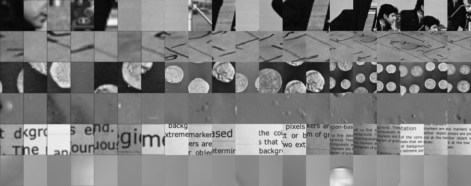

<div id="hogvis_image"></div>


Интерактивная демонстрация гистограммы направленных градиентов (HOG) на примере знаменитой специалистам компьютерного зрения фотографии ["Lenna"][lenna]. Для наглядности, каждое направление градиентов соответствует отдельному цвету.
<hr>

[](#)
[](#)
[](https://github.com/hav4ik/teaching/issues)

> Данный материал является дополнением к [лекциям проф. Клюшин Д. А.][klyushin] по распознаванию образов, а именно &mdash; к лекции о [методе опорных векторов (SVM)][klyushin-svm].

Один из первых вопросах студента после изучения [метода опорных векторов (SVM)][svm] &mdash; как его применять к разным практическим задачам? К задачам компьютерного зрения или анализа текста? В данном разделе, мы разберём классический пример применения метода SVM для **классификации**, а потом и для **детекции** лица на изображении.

Описанный в этом разделе метод для классификации и детекции, несмотря на свою простоту, до сих пор используются (с некоторой модификацией) в современном компьютерном зрении. Более подробно в параграфе [2.4](#24-выводы).

## 2.1. База размеченных фотографии лиц (LFW)

**LFW** (**L**abeled **F**aces in the **W**ild) &mdash; классическая база данных для распознавания лиц. Содержит `13233` изображении размером `47x62` пикселей. Как и многие стандартные игрушечные датасеты для тестирования и демонстрации методов распознавания образов, данную базу можно загрузить используя `sklearn.datasets`:

```python
from sklearn.datasets import fetch_lfw_people
faces = fetch_lfw_people()
```

Посмотрим на некоторые семплы в этом датасете. Можем заметить что некоторые лица встречаются 2 раза, что неудивительно &mdash; данную базу использовали для поиска похожих лиц, но мы будем его использовать для распознавания.


```python
import matplotlib.pyplot as plt
import numpy as np
positive_patches = faces.images

rows, cols = 6, 20
vis = None
idx = np.arange(positive_patches.shape[0])
np.random.shuffle(idx)
for r in range(rows):
    ri = None
    for c in range(cols):
        a = positive_patches[idx[r*rows + c]]
        ri = a if ri is None else np.concatenate([ri, a],  axis=1)
    vis = ri if vis is None else np.concatenate([vis, ri], axis=0)

plt.imshow(patches_vis, 'gray'), plt.axis('off')
```






Кстати говоря, задачу поиска похожих лиц решается с помощью комбинации  **PCA** или **LDA** и **SVM** &mdash; понижаем размерности лиц и проецируем на подпространство порождённое первыми собственными значениями, а затем используем метод опорных векторов для окончательного разделения. Более подробно можно посмотреть [вот тут][svm-face-identification]. Более детально о методах снижение размерности можно найти [в предыдущем разделе][prev-lecture].


## 2.2 Построение классификатора

Сперва, построим классификатор **лицо / не лицо**. Имея на вход изображение, такой классификатор должен сказать, что на нём изображено только лицо, или что-то другое.

В лоб использовать метод опорных векторов над пикселями изображения &mdash; глупо. Во-первых, размер изображения может быть огромным. Во-вторых, пиксели &mdash; не самое лучшее описание изображения, ведь фотография может содержать большое количество шума, сильно отличаться по освещению, баланс белого, коеффициентом дисторции и т.д. Нужны более усреднённые **локальные дескрипторы** &mdash; методы описания локальной области изображения, убирает лишнюю информацию, оставляя только релевантные.

### Гистограмма направленных градиентов (HOG)

**HOG** (**H**istogram of **O**riented **G**radients) &mdash; классический пример **локального дескриптора фич**. Основная мотивация проста &mdash; мы хотим отбрасывать информацию "плоских" областей, оставляя только информации о краях объектов. Построение гистограммы направленных градиентов происходит следующим образом:

**1. Посчёт градиента.** Чтоб построить HOG, сперва нужно посчитать градиент изменения цветовой интенсивности изображения. Пусть имеем изображение $$\boldsymbol{A} \in \mathbb{R}^{m \times n}\,$$. Частные попиксельные производные $$\boldsymbol{G}_x$$ и $$\boldsymbol{G}_y$$ будем аппроксимировать с помощью [оператора Собеля][sobel-op]:

$$
\begin{equation} \label{sobel} \tag{2.1}
\boldsymbol{G}_x = \begin{bmatrix}
    -1 & 0 & 1 \\
    -2 & 0 & 2 \\
    -1 & 0 & 1
\end{bmatrix} * \boldsymbol{A}
\enspace\quad\text{и}\quad\enspace
\boldsymbol{G}_y = \begin{bmatrix}
    -1 & -2 & -1 \\
     0 &  0 &  0 \\
     1 &  2 &  1
\end{bmatrix} * \boldsymbol{A}\,,
\end{equation}
$$

где $$*$$ обозначает операцию [свёртки][convolution]. Таким образом, попиксельный градиент изображения $$\boldsymbol{A}$$ можно посчитать как $$\boldsymbol{G} = \boldsymbol{G}_x + \boldsymbol{G}_y\,$$. Перейдём в полярные координаты:

$$
\begin{equation}
\boldsymbol{R} = \sqrt{\boldsymbol{G}^2_x + \boldsymbol{G}^2_y}\enspace,
\quad\quad
\boldsymbol{\Theta} = \arctan{\left(
\frac{\boldsymbol{G}_y}{\boldsymbol{G}_x}
\right)}\,.
\end{equation}
$$

Эмпирически было показано, что знак вектора не имеет значения. Поэтому вместо $$\boldsymbol{\Theta}$$ будем рассматривать $$\bar{\boldsymbol{\Theta}} = \boldsymbol{\Theta} \mod \pi\,$$.

**2. Построение гистограммы.** Изображение разбивают на прямоугольные *патчи* размером $$k \times k$$ (обычно на практике выбирают $$k = 8\,$$) и внутри каждого такого *патча* строят гистограмму:

- Выбирается количество интервалов $$b$$, на которую разбивается диапазон $$[0, \pi)\,.$$ На практике обычно выбирают $$b = 9\,.$$
- Значение гистограммы на каждом интервале равна сумме нормы градиентов $$\boldsymbol{G}_{ij}$$ в этом *патче*, значение угла $$\bar{\boldsymbol{\Theta}}_{ij}$$ которых лежит в этом интервале.

Такую гистограмму градиентов можно наглядно разглядеть на [интерактивной визуализации](#hogvis_image) в начале этого раздела.

**3. Нормализация.** Заметим, что такая гистограмма всё равно очень чувствительна к изменению цветовой гаммы, контраста, и освещения, а значит, не подходит нам в качестве локального дескриптора. Это можно легко исправить, нормализируя гистограмму по локально близким блокам (идея схожа на [скользящее среднее][moving-avg]).


```python
from skimage.feature import hog
from skimage import exposure
image = cv2.cvtColor(cv2.imread('Lenna.jpg'), cv2.COLOR_BGR2RGB)

imf = np.float32(image) / 255.0
gx, gy = cv2.Sobel(imf,cv2.CV_32F,1,0,ksize=1), cv2.Sobel(imf,cv2.CV_32F,0,1,ksize=1)
mag, angle = cv2.cartToPolar(gx, gy, angleInDegrees=True)

fd, hog_image = hog(image, orientations=8, pixels_per_cell=(16, 16),
                    cells_per_block=(1, 1), visualize=True, multichannel=True)
hog_image_rescaled = exposure.rescale_intensity(hog_image, in_range=(0, 10))

fig, (ax1, ax2, ax3) = plt.subplots(1, 3, figsize=(12, 4))
ax1.axis('off'), ax1.imshow(image, cmap=plt.cm.gray)
ax2.axis('off'), ax2.imshow((mag - mag.min()) / (mag.max() - mag.min()))
ax3.axis('off'), ax3.imshow(hog_image_rescaled, cmap=plt.cm.gray)
```


<div class="row">
<div class="col-md-4 text-center">

Изображение Ленны
</div>
<div class="col-md-4 text-center">

Попиксельное значние $$| \boldsymbol{G} |$$
</div>
<div class="col-md-4 text-center">

Гистограмма градиентов
</div>
</div>



### Классификация методом опорных векторов (SVM)

Сконкатенируем гистограммы направленных градиентов в каждом локальном *патче* в один вектор, которого назовём **вектором фич**. Это и будет нашим сжатым описанием изображения.

Для построения классификатора **лицо / не лицо**, осталось только собрать изображения негативного класса. Построим такой набор, вырезав куски из случайных изображений:


```python
from skimage import data, color, feature, transform
from sklearn.feature_extraction.image import PatchExtractor

imgs_to_use = ['camera', 'text', 'coins', 'moon', 'page', 'clock',
               'immunohistochemistry', 'chelsea', 'coffee', 'hubble_deep_field']
images = [color.rgb2gray(getattr(data, name)())
          for name in imgs_to_use]

def extract_patches(img, N, scale=1.0, patch_size=positive_patches[0].shape):
    extracted_patch_size = tuple((scale * np.array(patch_size)).astype(int))
    extractor = PatchExtractor(patch_size=extracted_patch_size,
                               max_patches=N, random_state=0)
    patches = extractor.transform(img[np.newaxis])
    if scale != 1:
        patches = np.array([transform.resize(patch, patch_size)
                            for patch in patches])
    return patches

negative_patches = np.vstack([extract_patches(im, 1000, scale)
                              for im in images for scale in [0.5, 1.0, 2.0]])
```






Внимательный читатель скорее заметит, что такой набор данных очень плохой &mdash; он содержит очень мало вариации, и много похожиз изображений. Но мне на момент подготовки этого материала откровенно лень собрать более качественный датасет &mdash; [и так сойдёт][i-tak-soidet].

Сформируем набор изображений `X` и разметку `y` из всего датасета, где `1` соответствует позитивному классу (изображениям с лицами):

```python
from itertools import chain
X = np.array([feature.hog(im) for im in chain(positive_patches, negative_patches)])
y = np.array([1] * positive_patches.shape[0] + [0] * negative_patches.shape[0])
```

Убедимся об эффективности [метода опорных векторов][klyushin-svm] для данной конкретной задачи, проводив [кросс-валидацию][cross-validation] (заметьте, как всё просто &mdash; всё пишется всего за пару строчек на питоне):

```python
from sklearn.svm import LinearSVC
from sklearn.model_selection import cross_val_score
cross_val_score(LinearSVC(), X, y)
```

Убедившись о том что метод хорошо работает, можем приступить к тренировке конечной модели на всём наборе `X` и `y`. Попробуем оптимально подобрать гиперпараметр регуляризации `C` для [метода опорных векторов с мягким зазором][klyushin-svm]. Сделаем это с помощью перебора:

```python
from sklearn.model_selection import GridSearchCV
grid = GridSearchCV(LinearSVC(), {'C': [1.0, 2.0, 4.0, 8.0]})
grid.fit(X, y)
```

После того как мы нашли наилучшие гиперпараметры, натренируем окончательную модель:

```python
model = grid.best_estimator_
model.fit(X_train, y_train)
```


## 2.3 Детекция с помощью классификатора

Имея натренированный классификатор (в данном случаи &mdash; для изображений размером `47x62`), можем легко с помощью него построить детектора. В отличие от классификатора, который отвечает на вопрос *что изображено на картинке*, детектор отвечает на вопрос **что изображено и где оно находится**. Алгоритм детектора выглядит следующим образом:


    1. Двигаем "окно" размером `47x62` по нашему изображению.
    2. Для каждого "окна" запускаем на нём наш натренированный классификатор.
    3. Запоминаем расположение "окон", для которых классификация положительна.

У данного алгоритма есть очевидная проблема: вокруг объектов нашего интереса (в данном случаи &mdash; лица) будут "кучковаться" большое количество таких позитивных "окон". Нужен алгоритм, который позволит их отсеять.


### Подавление не-максимумов (NMS)

Опишем алгоритм **NMS** (**N**on-**M**aximum **S**upression) в простейшем варианте для бинарных `0/1` классификаторов с статическим размером "окна":


    1. Отметим все "окна" как невыбранные.
    2. Случайно выбираем одно "окно":
        - Отмечаем его как выбранное.
        - Удаляем все "окна", которые имеют с ними площадь пересечения больше чем M.
    3. Если ещё есть невыбранные "окна", повторяем шаг 2.

где параметр `M` выбирается в зависимости от шага, с которым мы двигаем наше "окно".

> **Для олимпиадников:** придумайте реализацию данного алгоритма, который работает быстрее чем $$\mathcal{O}(n^2)\,$$, где $$n$$ &mdash; количество прямоугольников.

Расширенная версия этого алгоритма используется во всех современных детекторах объектов на основе глубоких конволюционных нейронных сетей ([Ren et al. 2016][faster-rcnn], [Redmon & Farhadi, 2018][yolov3], [Zhang et al. 2016][mtcnn]).

### Итоговый результат

Подытожим наш алгоритм детекции лица на примере фотографии [Одри Хепбёрна][audrey]:


```python
# 1. Загружаем тестовое изображение
test_image = skimage.data.load("audrey.png")

# 2. Проходим классификатором по "окнам" размером 47x62
def sliding_window(img, patch_size=(62, 47), istep=2, jstep=2):
    Ni, Nj = patch_size
    for i in range(0, img.shape[0] - Ni, istep):
        for j in range(0, img.shape[1] - Ni, jstep):
            yield (i, j), img[i:i + Ni, j:j + Nj]

idx, patches = zip(*sliding_window(test_image))
patches_hog = np.array([feature.hog(patch) for patch in patches])
labels = model.predict(patches_hog)

# 3. Сгенерируем прямоугольники и применим алгоритм NMS
Ni, Nj = positive_patches[0].shape
boxes = []
for i, j in (idx[k] for k in range(len(idx)) if labels[k] == 1):
	boxes.append([i, j, i + Ni, j + Nj])

nms_boxes = non_max_suppression_fast(boxes, 0.5)
```


<div class="row">
<div class="col-md-4 text-center">

Проход классификатором
</div>
<div class="col-md-4 text-center">

Положительные "окна"
</div>
<div class="col-md-4 text-center">

После выполнения NMS
</div>
</div>



## 2.4 Выводы

В данном разделе, мы детально рассмотрели практичный пример использования метода опорных векторов (SVM) для задач компьютерного зрения. Методы с похожим принципом работы до сих пор используются в современном компьютерном зрении:

- **Для фильтрации данных** &mdash; нейронные сети требуют очень много данных для тренировки, а нанимать [лейблеров][labeler] в индустрии очень дорого. Поэтому зачастую сперва фильтруют автоматически огромное количество данных простым классификатором, а потом уже отдают [лейблерам][labeler] для ручной разметки (2-х шаговая разметка).

- **Для автоматической разметки** &mdash; зачастую практикуют 2-х шаговую тренировку нейронной сети: сначало автоматически размечают данные с помощью классификатора  (как описан в этом разделе), а потом уже до-тренируют на более качественных данных. Например, [Gardner et al. (2017)][illumination].

- **Для простых задач** &mdash; есть задачи, которые не требуют огромных нейронных сетей для достижения хороших результатов.

Для улучшение результата, используют так же разные трюки, как **Hard Negative Mining** и **Boosting**. Поскольку мы рассматривали только игрушечные базы данных, эти трюки нам не понадобились.


[lenna]: https://en.wikipedia.org/wiki/Lenna
[klyushin]: http://om.univ.kiev.ua/ua/user-15/Pattern
[klyushin-svm]: http://om.univ.kiev.ua/users_upload/15/upload/file/pr_lecture_07.pdf
[svm]: https://ru.wikipedia.org/wiki/%D0%9C%D0%B5%D1%82%D0%BE%D0%B4_%D0%BE%D0%BF%D0%BE%D1%80%D0%BD%D1%8B%D1%85_%D0%B2%D0%B5%D0%BA%D1%82%D0%BE%D1%80%D0%BE%D0%B2
[svm-face-identification]: https://scikit-learn.org/stable/auto_examples/applications/plot_face_recognition.html
[prev-lecture]: /teaching/pr/01-dimensionality-reduction/
[sobel-op]: https://medium.com/datadriveninvestor/understanding-edge-detection-sobel-operator-2aada303b900
[convolution]: https://en.wikipedia.org/wiki/Kernel_(image_processing)
[moving-avg]: https://ru.wikipedia.org/wiki/%D0%A1%D0%BA%D0%BE%D0%BB%D1%8C%D0%B7%D1%8F%D1%89%D0%B0%D1%8F_%D1%81%D1%80%D0%B5%D0%B4%D0%BD%D1%8F%D1%8F
[i-tak-soidet]: https://cs10.pikabu.ru/post_img/2018/10/17/3/1539748594169948659.jpg
[nb-cls]: http://om.univ.kiev.ua/users_upload/15/upload/file/pr_lecture_04.pdf
[cross-validation]: http://long-short.pro/post/kross-validatsiya-cross-validation-304/
[audrey]: https://ru.wikipedia.org/wiki/%D0%A5%D0%B5%D0%BF%D0%B1%D1%91%D1%80%D0%BD,_%D0%9E%D0%B4%D1%80%D0%B8
[faster-rcnn]: https://arxiv.org/abs/1506.01497
[yolov3]: https://pjreddie.com/media/files/papers/YOLOv3.pdf
[mtcnn]: https://kpzhang93.github.io/MTCNN_face_detection_alignment/paper/spl.pdf
[labeler]: https://towardsdatascience.com/do-you-know-what-does-a-data-labeler-do-98561cb0029
[illumination]: https://arxiv.org/pdf/1704.00090.pdf